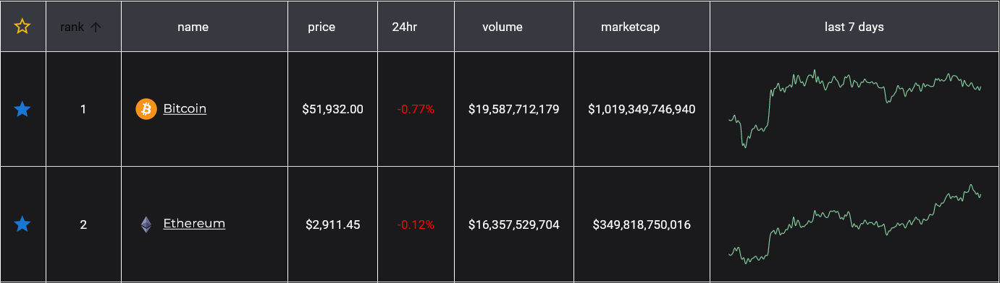

# Crypto Price Website

## Introduction

Here is a website where you can view the real-time updated prices of the top 100 Crypto coins. There are graphs showing how they
have performed over the last 24 hours and 7 days. You can sign in and set up a Portfolio for yourself where you can view your
'favourited' coins and also play a mini game of putting in a mock amount of money into each and see how much you would of lost
or won over time.

### How to Use
[Crypto Pricing](https://ceegecrypto.firebaseapp.com/)

You start at the home page where you see a table with the top 10 coins of the day. You can view the total coins, market cap and
24hr volume of all coins or you can see individual coins and how they have been performing. The graph on the homepage shows how
its performed over the last 7 days. Then you can signup or login into an account, here you will be taken to your profile page
where you can see a portfolio. You can 'favourite' coins to show in your portfolio where you can make a mock investment to see
how you would of performed if you had invested into it.

    

### Technologies

This project has been created in React Javascript using the following libraries and other help:
- Moment
- Material UI
- Firebase
- React Bootstrap
- Axios
- React Router Dom
- Recharts
- Node.js
- CSS and HTML
- Netlify

### Motivation

I have become very interested in Crypto and the crypto space over the past 3 years. I have invested and regularly use a website
called CoinGecko. I wanted to recreate a similar website (which would be a little more streamlined) and thats where this idea was
born from. I am fascinated by the Crypto space and will be interested going forward in more ideas around building stuff based on
Crypto.

### Next Steps

- I would actually like to take out the firebase backend and use Express or Python instead, because I want to utilize the coinspot API so I could link my account so I can view how my coins are doing, from there potentially be able to buy and sell coins from my website, but I worry slightly about security issues.
- Fix the dark/light mode to change the navbar aswell to light/dark
- Flesh out the practice investment game in the portfolio section

### Credits

Thank you to Loden, Joel and my roommate Quant for all the help they have given me over the past week and also the past 3 months
I have come along way from when I started on TicTacToe and have been really proud of this final project
